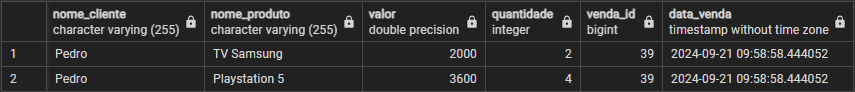

# Projeto de Sistema de Vendas

Este é um sistema básico de vendas desenvolvido em Java, utilizando JPA (Java Persistence API) para o mapeamento objeto-relacional (ORM). O projeto simula a criação de clientes, produtos, vendas, e o relacionamento entre vendas e produtos por meio de uma tabela intermediária.

## Funcionalidades

- **Cadastro de Clientes:** Permite criar novos clientes com informações como nome, CPF, telefone, endereço, número, cidade e estado.
- **Cadastro de Produtos:** Permite adicionar produtos ao sistema com nome e valor.
- **Cadastro de Vendas:** Criação de vendas associadas a clientes e a produtos. Uma venda pode conter múltiplos produtos com suas respectivas quantidades.
- **Exclusão de Registros:** Suporte à exclusão de vendas e seus produtos associados, tanto manualmente quanto automaticamente através de exclusão em cascata.
  
## Estrutura do Projeto

### Entidades

- **Cliente:** Representa um cliente com informações pessoais.
- **Produto:** Representa um produto disponível para venda.
- **Venda:** Representa uma venda associada a um cliente e a múltiplos produtos.
- **VendaProduto:** Representa a relação entre vendas e produtos, contendo a quantidade de cada produto vendido.

### Tabelas

1. **`tb_cliente`:** Armazena informações dos clientes.
2. **`tb_produto`:** Armazena os produtos disponíveis no sistema.
3. **`tb_venda`:** Armazena as vendas associadas a clientes.
4. **`tb_venda_produto`:** Armazena o relacionamento entre vendas e produtos, incluindo a quantidade de cada produto na venda.

## Pré-requisitos

- **Java 8+**
- **Maven**
- **Banco de Dados PostgreSQL** (ou outro banco de dados compatível com JPA)
- **JPA** (Hibernate ou outra implementação)

## Estrutura SQL

- select * from tb_cliente;
- select * from tb_produto;
- select * from tb_venda;
- select * from tb_venda_produto;

- SELECT c.nome AS nome_cliente, p.nome AS nome_produto, p.valor, vp.quantidade, vp.venda_id, v.data_venda
FROM tb_venda v
JOIN tb_cliente c ON v.id_cliente_fk = c.id
JOIN tb_venda_produto vp ON v.id = vp.venda_id
JOIN tb_produto p ON vp.produto_id = p.id;

## Observações 

- Certifique-se de que o banco de dados esteja configurado corretamente.
- As exclusões na tabela `tb_venda_produto` são feitas automaticamente quando uma venda é excluída.

## Autor

**Lucas Bomfim** - Desenvolvedor do projeto.

## Contribuição

Sinta-se à vontade para contribuir com melhorias ou correções!

## Licença

Este projeto é licenciado sob a MIT License - veja o arquivo [LICENSE](LICENSE) para mais detalhes.